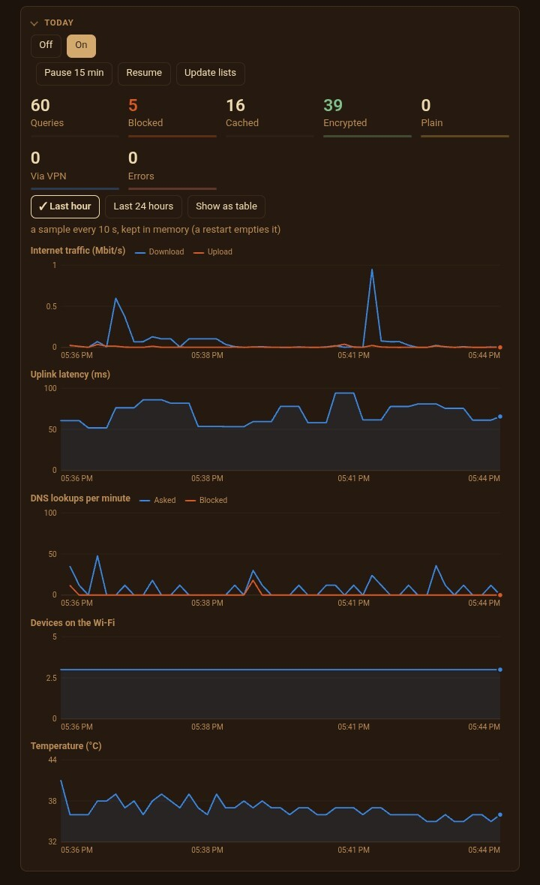

<p align="center"></p>

# PillowForrT
https://badlucksbane-lucky.github.io/stone-of-heimdall/

**A privacy and intrusion-watching firmware layer for the Orbic RC400L cellular hotspot.** One static Go binary (`tinyfwd`) replaces the stock admin page and takes over DNS, the firewall, Wi-Fi settings and the exits, then sits on the LAN bridge and watches the wire. It filters DNS and forces it to leave encrypted, sends chosen devices through a VPN or Tor, closes the IPv6 and WebRTC address leaks, blocks outbound services you have not approved, and raises an event when something on your network behaves like a scanner, a spoofer, a rogue router, malware phoning home, or an interception box sitting in the path to the internet.

**It watches before it guards.** A fresh install only reports what your devices tried to reach (the "would be refused" list), and you decide what to allow before anything is enforced. Every detector is passive: nothing is ever sent, nothing is decrypted, and the text of an event never names a device or an address.

<p align="center"></p>

## Contents
- [What it guards](#what-it-guards)
- [What it watches for](#what-it-watches-for)
- [The rest of the page](#the-rest-of-the-page)
- [Feeding other tools](#feeding-other-tools)
- [How it is put together](#how-it-is-put-together)
- [Build and test](#build-and-test)
- [Repository map](#repository-map)
- [What it does not do](#what-it-does-not-do)
- [First install](#first-install)
- [How it was made](#how-it-was-made)
- [Status and license](#status-and-license)

## What it guards
Tested on one unit; see ["Check it yourself"](docs/INSTALL.md#check-it-yourself) in `docs/INSTALL.md` to verify each one on yours. The full list of claims, and where each one stops, is in [`docs/THREAT-MODEL.md`](docs/THREAT-MODEL.md).

- **Encrypted DNS, or nothing.** Every query goes `device -> dnsmasq -> filter stub -> DNS-over-HTTPS` (Quad9 and Cloudflare by default, dialled by IP so there is no bootstrap lookup). Plain DNS and DNS-over-TLS are refused out of the cellular side, so a device with its own resolver settings gets nowhere. If DoH is down the lookup is refused (SERVFAIL) with a visible warning and an event: there is no plain-DNS fallback to turn on or off, in the code or in the firewall.
- **A DNS filter** with a catalog of published block lists, your own wildcard rules (`*.example.com`, `ads*.example.com`, `*track*`, per device, optionally for a limited time), an allow-list that always wins, per-device modes, and a "why was this blocked?" box that names the list or rule responsible. Lists live in memory as sorted 64-bit hashes, so switching one on or off is instant and 130k names cost about 1 MB.
- **DNS rebinding refused.** A public name that resolves to a private address (this LAN, loopback, link-local, carrier-grade NAT, the Tor bridge range) is answered REFUSED instead of relayed: that answer is how a web page rebinds itself to a device on your LAN and talks to it as if it were its own server, and nothing on this box ever resolves a public name that way on purpose. An allow-list covers the few services that do it by design (`*.plex.direct` from the start), and the ARP / DNS correlation card still records every answer refused.
- **Per-device exits:** direct, Mullvad (an in-process WireGuard tunnel with a kill switch, so a dead tunnel blocks instead of leaking), or Tor (forced in the kernel by MAC, fails closed). The whole house can default to the VPN, and PAC-proxy users ride it too.
- **No IPv6 leaks.** LAN IPv6 is off by default: the stock router-advertisement relay is muzzled, LAN IPv6 headed for the cellular side is refused, and a withdraw advertisement makes devices drop the address they already hold. Without this a device behind the IPv4-only tunnel still showed its real carrier IPv6 address through WebRTC.
- **Default-deny outbound.** Forwarded connections are matched against an allow-list of services, global or per device. A fresh install ticks web, QUIC, clock sync, ssh, email and push notifications; calls, consoles, VPN protocols, torrents, remote desktop, MQTT and IRC are off. A monitor mode samples the connection table every 10 seconds and tallies, per device, what *would* be refused, so you build the list from what the house really uses before you flip it to enforce.
- **Plain HTTP is sent to HTTPS first.** Port 80 stays open, but a connection to it from a device is answered by the box with a redirect to the `https://` address of the same page (nothing is proxied or decrypted). If the same device comes straight back for the same site and no TLS connection to it exists, the upgrade did not work: that is counted, noted as an info event with no names in it, and that one request is let through. It is on by default and can be switched off globally or left off for one device on the Outbound services card; a client that cannot follow redirects (curl without `-L`, some gadgets and firmware updaters) needs that. IPv4, port 80 only. In enforce mode DNS and DNS-over-TLS are also refused by the first rules of the outbound chain, ahead of anything ticked.
- **Blocked devices that stay blocked.** The stock Wi-Fi deny list does not hold on this driver (a dropped device walked straight back in), so a blocked MAC is dropped in the firewall and deauthenticated whenever it reappears.
- **Blocked destinations** (IP or CIDR, for every device and for the router's own proxied traffic), and **internet schedules and pauses** per device that cut the internet but keep the LAN, DHCP and this page.
- **House-wide `.onion`** (off until you switch it on over SSH: [`.onion` settings](docs/INSTALL.md#onion-settings-ssh-only)). A small client-only Tor runs on the box. With it on, any device can open a v3 `.onion` name with no setup: the stub answers with an address from `198.18.0.0/16` and the firewall sends that TCP through a bridge into Tor's SOCKS port. A `.onion` name never reaches a public resolver.
- **The stock admin switched off** for the network (reversibly), the carrier's firmware-update and remote-management engines kept suspended, and WPS forced off every five minutes in case a reset turns it back on.
- **A web page over HTTPS** behind one bcrypt login with a session cookie and CSRF token; optional API-key token for scripts, off by default. Key-only SSH. No telemetry. Nothing leaves the house unless you configure it.

## What it watches for
Seventeen detectors run on the box, most of them reading the LAN bridge through an `AF_PACKET` socket with a kernel filter that passes only the frames they need. Each finding becomes an event at one of two levels: **alert** (something is impersonating or steering the network) or **to look at** (unusual, with a benign explanation possible); the LAN announcements card adds a third, **info**, for a device announcing a new service, which is inventory rather than a finding. Three detectors keep a baseline on flash (which certificate and TLS version a name presented, what each device announced, which addresses two resolvers gave) and raise only on a change from it, so the first days after an install are the quiet period in which they learn the house. ["The detectors"](docs/INSTALL.md#8-the-detectors) in `docs/INSTALL.md` covers running them: checking capture, quieting a known-good source, push notifications, and turning one off. Each detector's source file opens with its honest limits; the main one is shared: traffic the radio relays Wi-Fi-to-Wi-Fi never reaches the bridge, though broadcasts, multicast and anything aimed at the router do, and anything headed for the internet passes through it.

| Card | What it sees | Findings |
|---|---|---|
| **ARP watch** | Every ARP claim and request on the bridge | A foreign MAC claiming the router's address (alert); a MAC claiming an address reserved for another device (alert); an address changing owner within 10 minutes (to look at: poisoning looks like this, but so does a phone rejoining with a fresh random MAC); one device asking for 20 or more different LAN addresses within a minute (to look at: a host scan, the first step of nmap and of a worm, which the canary only catches when it touches the decoy; a new phone looking for printers does it once) |
| **MAC churn** | The same ARP stream over a wider window | One IP claimed by three or more MACs, or one MAC claiming four or more IPs, within 10 minutes |
| **Rogue DHCP** | Every DHCP offer, ack and nak | A reply not from the router's own address *and* own MAC: a plugged-in router, a phone sharing its connection, a hostile device |
| **Steering watch** | IPv6 router advertisements and ICMPv6 and ICMPv4 redirects, the messages that tell a device to change its router | Any of them from a MAC other than the router's own (alert). A rogue advertisement makes every device that hears it use the sender as its IPv6 router, and with an RDNSS option as its DNS server too, which Windows prefers over the one DHCP gave it: the `mitm6` attack, and it works on the LAN whether or not LAN IPv6 is on. A redirect from a non-router steers one device's traffic through another. A second router you run can be allowed by MAC |
| **DHCP fingerprint drift** | Option 55 in each DHCP request, the same passive fingerprint Fingerbank and p0f use | A MAC whose fingerprint had settled now sends a different one: new firmware, or a different device answering for a trusted address. One event per MAC per day at most |
| **Canary** | A decoy address, `192.168.1.253`, that the router answers for and tarpits | Anything that pings it, ARPs for it or opens a port there is looking around; five or more ports from one source is a scan |
| **Bare-IP TLS** | The ClientHello of every outbound TLS connection, the one plaintext part of the handshake | A connection with no SNI, or with an IP address as the SNI: hand-rolled C2 clients, TLS probes and a few IoT devices do this; browsers do not. The same ClientHello is also fingerprinted as a JA3 hash and checked against an operator-supplied blocklist (empty and silent until you populate one) — a match is an alert, a stronger signal than the bare-IP heuristic alone |
| **Certificate change** | The server's half of the handshake: the ServerHello in every TLS version, and in TLS 1.2 the certificate itself, keyed by the hostname the device asked for | A name signed by a public CA turning self-signed (alert); a certificate that no longer covers its name, an issuer changing organisation, or a name that always negotiated TLS 1.3 being talked down to 1.2 (to look at): the shapes an interception box in the path leaves. Renewals and first sightings are the silent baseline, kept on flash. TLS 1.3 hides its certificate, so an interceptor that speaks 1.3 is invisible here |
| **DNS canary** | Every query, from inside the stub | A device asked for one of a few decoy names nobody configured; a query that left as plain port 53 while the stub was doing DoH (something routed around it); a run of long, high-entropy subdomains of one base name, the shape of DNS tunneling |
| **NXDOMAIN flood** | Every answer, from inside the stub | One client racking up NXDOMAIN answers for many *different* base names in a few minutes: the signature of a domain-generation algorithm, distinct from tunneling |
| **Resolver cross-check** | One in fifty encrypted answers, put to the other configured DoH resolver as well | A disagreement in shape between the two resolvers: one says a name exists and the other says it does not, or one hands back a private or unroutable address where the other hands back a public one (to look at). Different CDN addresses from two honest resolvers are only counted. It cannot say which resolver is wrong |
| **LAN announcements** | Every mDNS (Bonjour) and SSDP (UPnP) announcement on the bridge, the multicast that reaches it even from devices the radio relays directly | An inventory of what each device says it is (its `.local` name, services, UPnP server string); a device announcing a service it never announced before (info); two addresses answering for the same `.local` name, or a UPnP announcement whose description URL lives at another address (to look at). Nothing is verified and nothing is asked |
| **Hidden router** | The IP time-to-live of each connection's first packet (a TCP SYN or a DNS query), per source MAC | Every OS starts at a fixed TTL (64, 128, 255) and every router takes one off, so a device whose connections arrive one short is forwarding for something behind it: a phone re-sharing the hotspot, a travel router, a hidden second machine (to look at; a laptop running containers or a VM looks the same, so it can be marked expected). Two initial TTLs from one address at once is two operating systems on one MAC |
| **Stock admin tripwire** | TCP SYNs to the stock admin's ports 81 and 444, read off the wire before the firewall rejects them | Once the stock admin is switched off nothing honest knocks there, so a knock is something looking for the factory login page (to look at, once per source per 10 minutes). Quiet while the stock admin is on |
| **ARP / DNS correlation** | The two findings above, together | A public name answered with a LAN address is suspect on its own (nothing on this box ever does that); within a short window of an ARP impersonation it is a confirmed man-in-the-middle (alert) |
| **Tor / proxy bypass** | Outbound connections and `.onion` queries | A device not assigned to the house's Tor path reaching a known Tor relay (ships with the relay list empty and off until you populate it); a device asking for a `.onion` while house-wide `.onion` is off |
| **Beacon patterns** | New connections per (device, destination) pair over two hours, from the same sampler the allow-list uses | Connections spaced regularly, 30 seconds to an hour apart. Deliberately the noisiest detector: IMAP idle, chat heartbeats and smart-home polling look exactly like this, so it is never more than "to look at" |

Rate limits keep the page readable (typically one event per source per 10 minutes, one per name per hour for the baseline detectors), the canary, DNS canary, beacon and hidden-router detectors let a device or destination be marked expected and a known second DHCP server can be allowed by MAC, and the firmware's own **events** detector adds the ordinary signals: a device never seen before, the uplink down and back, encrypted DNS failing, a service dying, the box running hot, bursts of failed ssh logins, a radio dropping out, the certificate renewed, the data plan crossing a threshold, restarts. The event log on flash is a hash chain: each event carries the hash of the one before, so an edit, a deletion or a truncation shows on the Events card and in diagnostics as "broken at event N", and the head hash can be copied off the box to compare later (someone with a root shell can rewrite the whole chain, so that copy is the only real tamper evidence; see `events.go`). Events can be pushed to an [ntfy](https://ntfy.sh) topic you choose; that is the one outward-facing feature, so it is off until you give a URL, and what is sent is a generic sentence only.

## The rest of the page
One single-page web UI with collapsible cards. Besides the filter, exits and detectors above:

- **Devices**: one row per device joining the radio (band, connected since), ARP and NDP addresses, reservations, leases, labels and notes you write, the block list, pauses and schedules, DNS activity and exit. **Presence** says who is here now and since when, who was last seen when, and what each device calls itself (host name and DHCP vendor class); devices you choose to watch raise an event when they arrive or leave. Wake-on-LAN.
- **Wi-Fi** settings for both bands, replacing the stock page: every change is backed up, verified against the regenerated hostapd config, and rolled back by itself on a mismatch. The password is write-only.
- **DHCP reservations and pool**, edited in the stock files so they survive a reboot; a reservation change releases the device's old lease so it actually moves.
- **Latency history**: weeks of uplink latency and loss on flash in hourly buckets, with an outage log and a "flaky" event when the link is lossy without being down. **Speed history**: a small download and upload every few hours, never while the house is using the link. **Live graphs** of rates, latency, queries, clients and temperature for the last hour and day, in RAM only.
- **Diagnostics**: one click runs every check and says in plain words what is fine, what deserves a look and what is broken. The report is written to share: no names, MACs, messages, keys or full IPv6 addresses.
- **Scheduled actions** from a fixed list (snapshot, update block lists, run diagnostics, reboot), never an arbitrary command; a reboot needs the word typed and is refused within 10 minutes of boot so a bad schedule cannot loop.
- **Backup**: settings snapshots kept on the box and downloadable, restorable per section, with a "before restore" snapshot taken first. Identity (VPN key, login, TLS key, tokens) is deliberately not in them.
- **Certificate**: the self-signed HTTPS certificate renews itself at 60 days left or on demand, without a restart, and can be downloaded to trust on a device.
- **SSH access**: dropbear's authorized keys (public keys only, ed25519, forwarding always off), the host fingerprint, and a login audit trail. The last key cannot be removed from the page.
- **Onion door** (off until you switch it on over SSH; the web page has no setting for it): a Tor onion service that reaches this page from anywhere with no open port, behind three locks (v3 client authorization, the login, read-only unless you turn remote write on). With no authorized client the service is not rendered at all.
- **System** and **cellular** pages read straight from `/proc`, `/sys` and the stock config files; a confirmed reboot; no IMEI, serials or factory reset on offer. A read-only **SMS inbox** from the stock SQLite file, queried from a RAM copy and never written.
- **Node**: `/status.json` reports what the box sees from the carrier's edge, a `/beat` heartbeat lets a companion computer be noticed when it goes silent, and `/metrics` serves aggregate-only numbers in the Prometheus text format, safe to scrape without a login.
- A built-in **PAC file and forward proxy** on `:3128` (the daemon's original job), LAN-only, with a destination guard so a client cannot use it to reach the hotspot's own loopback services.

## Feeding other tools
The box is a sensor other stacks can consume. Everything below is off until you switch it on in the **Export** card, and every destination must be an IP address on your own network (never a name, never a public host). ["Feeding other tools"](docs/INSTALL.md#9-feeding-other-tools) in `docs/INSTALL.md` has the setup for each.

- **Grafana**: `/metrics` already serves the Prometheus text format without a login; [`contrib/grafana/`](contrib/grafana/) holds a dashboard to import.
- **Event stream**: `/api/events/stream` is the event log as newline-delimited JSON in the shape of Suricata's EVE log, one `alert` record per event with the kind, severity and chain hash under `stone`, so Wazuh, Graylog, Loki, Vector, Elastic and anything with an EVE parser ingests it unchanged. `?since=<id>` resumes, `?follow=1` keeps the connection open. Behind the login or the script token; through the onion door only the generic sentence is sent.
- **Syslog**: the same events as RFC 5424 messages over UDP to a collector on the LAN, with the chain fields as structured data so the collector's copy stays verifiable.
- **Packet tap**: `/api/tap` streams what the bridge sees as a pcap file, so Suricata, Snort, Zeek or Wireshark on a companion computer read the LAN live without running on 77 MB of RAM. It is the one feature that exports raw frames with addresses in them, so it is off by default, LAN only, one at a time, an hour at most, and its own connection is excluded in the kernel filter. It sees what the detectors see: not traffic the radio relays Wi-Fi-to-Wi-Fi.
- **WiGLE**: the serving cell (PLMN, tracking area, cell id, technology, signal) read from the modem over its AT port, stamped with the location a companion sends (the hotspot has no GPS: `scripts/gps-feed.sh` reads gpsd, a phone or a fixed position works too), and downloaded as a WiGLE CSV. Telemetry out only: nothing here compares observations or raises an event, and the cell and the location never appear in `/status.json`, `/metrics`, a notification or the event exports. Off until you give the port; a probe button finds it.
- **Home Assistant**: with a broker on the LAN the box announces itself through MQTT discovery (uplink, latency, Wi-Fi clients, temperature, events, data used, DNS counters, encrypted DNS, VPN, Tor), a presence tracker per device, each event on an MQTT topic for automations, and optionally a switch per device that pauses its internet. Plain MQTT to the LAN only; the broker password is kept at mode 0600 and is never shown back or snapshotted.

## How it is put together
- **`tinyfwd`**, one static Go binary, cross-built for ARMv7 with everything vendored: the DNS stub (its own minimal wire parser, no DNS library), the HTTPS page, the proxy, the WireGuard tunnel (wireguard-go as a library, no kernel module), all the detectors, and the supervisors for dnsmasq and Tor. It runs on one Cortex-A7 core with about 77 MB of usable memory, which is why block lists are hash sets, graphs are rings, the stub caps in-flight queries at 64 and nothing keeps a query history on flash.
- **Kernel rules** are rendered into chains the project owns, all prefixed `HS_` (`HS_FW`, `HS_EXIT`, `HS_KILL`, `HS_TOR`, `HS_MACBLOCK`, `HS_LANV6_*` and so on), loaded atomically with `iptables-restore --noflush`, and re-asserted on a loop because the stock firmware rebuilds its own chains on some network events.
- **`wpad-guard.sh`** is the standing guard: a 60-second loop that keeps the services address `192.168.1.254` on the bridge, the DNS redirect, SSH, the IPv6 firewall and the firmware-update suspension in place. tinyfwd also runs it once (`wpad-guard.sh once`) whenever the cellular link changes (interface state, addresses, the carrier resolver file) and whenever a check of three of its rules finds one missing, so a firewall rebuilt by the firmware does not leave plain DNS open until the next 60-second pass (`guardwatch.go`, `-guard-script`).
- **Third-party programs** fetched from their own sources: a current static dnsmasq (2.91, swapped in over the stock 2.73 with automatic rollback), dropbear for key-only SSH, and a client-only Tor.
- **Stock files are edited, not replaced**, where a reboot must keep the result (Wi-Fi XML, DHCP pool XML, reservations), always backed up first; where the stock behaviour is simply wrong (the Wi-Fi deny list, the firewall pages) it is bypassed with the project's own rules.

## Build and test
```
./build.sh                       # cross-builds ./tinyfwd for the hotspot and prints its SHA-256
GOFLAGS=-mod=vendor go test ./...  # the unit tests, offline (343 of them at the time of writing)
```
Needs Go 1.24 or newer and nothing from the network. The deploy script checks the printed hash on the unit, and `-buildvcs=false` in `build.sh` is what keeps that hash reproducible. The rule evaluation, planners and thresholds are pure functions so the tests cover them without hardware; the installer has its own tests under `install/test/`.

## Repository map
| Path | What is there |
|---|---|
| `*.go` | The daemon, one file per feature, each opening with a comment that says what it does and where its claims stop. Start with `main.go`, then `dnsproxy.go`, `egress.go`, `events.go`; `tlssni.go` and `tlscert.go` are the two halves of the TLS handshake, `lanannounce.go` the device inventory, `dnsxcheck.go` the second opinion on DNS, `rebind.go` the rebinding refusal, `ttlwatch.go` the hidden-router watch, `admintrip.go` the stock admin tripwire, `steer.go` the steering watch; `export.go`, `tap.go`, `hass.go` and `mqtt.go` feed other tools, `cell.go` the tower telemetry |
| `ui.html`, `login.html` | The single-page UI and the sign-in page, embedded in the binary |
| `docs/` | [`INSTALL.md`](docs/INSTALL.md), [`THREAT-MODEL.md`](docs/THREAT-MODEL.md), [`SECURITY.md`](docs/SECURITY.md) |
| `scripts/` | Run from a trusted computer on the LAN over SSH: deploy the binary with rollback, push the guard, set the login, copy files, call the API. `wpad-guard.sh` and `dhcp-hook.sh` run on the unit |
| `install/` | `stone-install`, the experimental first-install tool over USB; `device/bootstrap.sh` runs on the unit and journals every change so it can roll back; `payload/` holds the init script and the dnsmasq and WPS guards |
| `fork/` | Two files from EFF's [rayhunter](https://github.com/EFForg/rayhunter) (GPL-3.0, unlike the rest): the root shell used by the installer, and its AT-channel installer kept for reading and as a starting point |
| `contrib/grafana/` | A Grafana dashboard for `/metrics` |
| `assets/`, `site/` | Logo and brand files ([`assets/README.md`](assets/README.md)); the GitHub Pages landing page |
| `vendor/` | Vendored Go dependencies, so the build is offline |

## What it does not do
- It is not anonymity. Your carrier still knows where your hotspot is and sees connection metadata. The VPN provider sees what the carrier otherwise would.
- It cannot see inside encrypted traffic and does not try to. The detectors read what is already in the clear (ARP, DHCP, mDNS and SSDP announcements, both plaintext halves of the TLS handshake, DNS inside the stub, connection metadata) and nothing else. TLS 1.3 hides the server's certificate, so the certificate-change watch sees only TLS 1.2 certificates and the negotiated version of everything.
- Detectors are signals, not proof. Each one states its false positives, and the noisier ones never rise above "to look at".
- It has been tested on **one unit** of one model on one carrier. Rooting the hotspot may void its warranty or breach the carrier's terms, and reading some flash partitions can freeze the device until a power cycle. You are responsible for your own hardware.

## First install
**Experimental and untested from a factory-fresh unit.** `install/stone-install` installs over the USB cable with questions in the terminal, journals every change and rolls back on failure. Its pieces were tested separately, but the whole path has not yet been run from a stock unit. Read ["First install"](docs/INSTALL.md#first-install-experimental-untested-on-a-factory-fresh-unit) in `docs/INSTALL.md` before you try it. Updating, signing in and configuring a unit that already runs it are documented there too.

## How it was made
Written by Claude, an AI model made by Anthropic, under the direction of the project's maintainer, who set the goals and decisions and tested it on their own hardware. The maintainer did not write or line-by-line audit the code. It has a large automated test suite and one real unit's worth of use. Read it before you trust it with anything that matters.

## Status and license
Early, and a **source release** for now: the install guide is in [`docs/`](docs/); the first-install tool is experimental and untested from a stock unit, so expect to read the code. Licensed under the [MIT license](LICENSE), except the two files in `fork/` (GPL-3.0, from rayhunter); third-party programs it installs (dnsmasq, dropbear, Tor) are fetched from their own sources and keep their own licenses.

- [`docs/SECURITY.md`](docs/SECURITY.md) — how to report a vulnerability
- [`docs/THREAT-MODEL.md`](docs/THREAT-MODEL.md) — what it defends against, and what it does not
